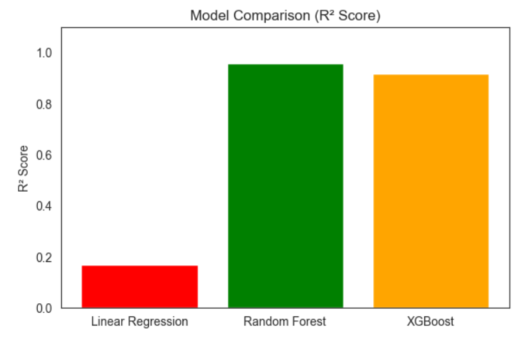
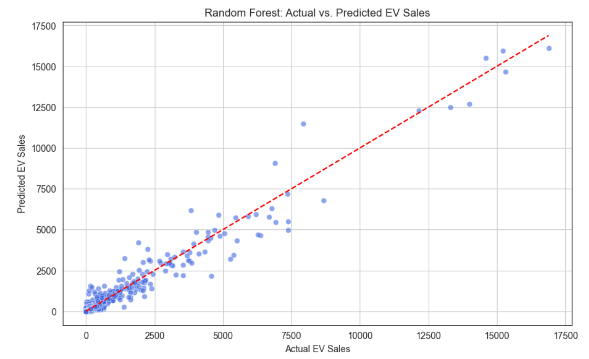

#  Electric Vehicle (EV) Sales Analysis and Prediction in India

##  Overview

This project analyzes and predicts the sales of Electric Vehicles (EVs) across various Indian states using machine learning techniques. The dataset includes vehicle categories, types, and regional information. Key insights are drawn to assist policymakers and businesses in understanding adoption trends.

---

##  Key Metrics

| Metric                       | Value      |
|-----------------------------|------------|
| **Total EV Sales**          | ~3.6M   |
| **States Covered**          | All Indian States & UTs |
| **Number of Years** | ~11 years (2014-22)     |

---

##  Breakdown

###  Sales by Vehicle Type
- **2W_Personal**: 11,700
- **4W_Personal**: 4,111
- **4W_Shared**: 4,580
- **Bus**: 7,026
- **Others**: 54,423 (total across miscellaneous types)

###  Sales by Vehicle Category
- **2-Wheelers**: 13,121
- **3-Wheelers**: 11,491
- **4-Wheelers**: 8,691
- **Bus**: 9,119

###  Regional Sales (Top States)
- **Uttar Pradesh**: 0.73M+
- **Maharashtra**: 0.40M+
- **Karnataka**: 0.32M+
- **Delhi**: 0.27M+
- **Rajasthan**: 0.23M+

---

##  Insights

- **Dominant Category**: 2-Wheelers lead by a large margin in sales.
- **Strong Growth**: Increasing adoption in 4-Wheeler segments.
- **Concentration**: Top 5 states account for ~59% of national EV sales.
- **Market Opportunity**: 4W Personal segment shows high potential.

---

##  Machine Learning Models Used

| Model              | R² Score | RMSE    | MAE     |
|--------------------|----------|---------|---------|
| **Linear Regression** | 0.17     | 917.99 | 420.27  |
| **Random Forest**      | **0.96** | **207.66** | **57.16** |
| **XGBoost**            | 0.92     | 277.67 | 106.08  |

 **Best Model**: **Random Forest Regressor**

---

##  Visualizations

- **Bar Charts**: 
  - EV sales by vehicle category
  - EV sales by vehicle type
- **Line Chart** *(if done)*: 
  - EV sales trend across states or other numeric feature

---

##  Tools & Libraries

- **Python**
- `pandas`, `numpy`
- `matplotlib`, `seaborn`, `plotly`
- `scikit-learn`
- `xgboost`
- `Jupyter Notebook`

---

##  Future Work

- Deploy a dashboard using Streamlit or Flask.
- Incorporate external socio-economic data to improve prediction.

---

##  Conclusion

This project offers valuable insights into EV sales trends and provides a strong predictive model using Random Forest. It serves as a solid foundation for data-driven policymaking in India's green transportation initiatives.

---
